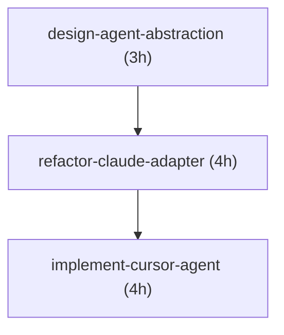

# Sentinel v2.0 Specifications

**Comprehensive task graphs and specifications for advancing the Sentinel platform.**

## What's In This Directory

This `.speculate/` directory contains the complete roadmap and specifications for advancing Sentinel from v1.0 (Claude Code monitoring) to v2.0 (multi-agent AI monitoring platform).

### 📋 Key Documents

| Document | Purpose | Start Here If... |
|----------|---------|------------------|
| **MASTER_PLAN.md** | Complete strategic roadmap with phases | You want the big picture |
| **QUICKSTART.md** | Developer quick-start guide | You're ready to code today |
| **ROADMAP.md** | High-level timeline and goals | You need timeline overview |

### 🎯 Category Specifications (JSON)

Each category has a detailed JSON spec with atomic tasks:

| # | Category | Priority | Hours | Tasks | File |
|---|----------|----------|-------|-------|------|
| 1 | Multi-Agent Support | CRITICAL | 28 | 8 | `01-multi-agent-support.json` |
| 2 | Data Export & Analytics | HIGH | 24 | 8 | `02-data-export-analytics.json` |
| 3 | Advanced UI/UX | HIGH | 22 | 8 | `03-advanced-ui-ux.json` |
| 4 | Customization & Theming | MEDIUM | 16 | 7 | `04-customization-theming.json` |
| 5 | Performance & Reliability | CRITICAL | 26 | 9 | `05-performance-reliability.json` |
| 6 | Developer Integrations | MEDIUM | 20 | 7 | `06-developer-integrations.json` |
| 7 | Advanced Monitoring | HIGH | 22 | 7 | `07-advanced-monitoring.json` |
| 8 | Testing & Quality | CRITICAL | 22 | 8 | `08-testing-quality.json` |

**Total: 62 tasks, ~180 hours**

---

## Quick Navigation

### I want to...

**Understand the overall plan:**
→ Read `MASTER_PLAN.md`

**Start developing immediately:**
→ Read `QUICKSTART.md`

**Work on multi-agent support:**
→ Open `01-multi-agent-support.json`

**Add data export features:**
→ Open `02-data-export-analytics.json`

**Improve the UI/UX:**
→ Open `03-advanced-ui-ux.json`

**Add themes and customization:**
→ Open `04-customization-theming.json`

**Optimize performance:**
→ Open `05-performance-reliability.json`

**Create integrations:**
→ Open `06-developer-integrations.json`

**Add monitoring features:**
→ Open `07-advanced-monitoring.json`

**Set up testing:**
→ Open `08-testing-quality.json`

---

## Specification Format

Each JSON spec file contains:

```json
{
  "category": "Category Name",
  "priority": "CRITICAL | HIGH | MEDIUM",
  "total_estimate_hours": 28,
  "description": "What this category accomplishes",

  "tasks": [
    {
      "id": "kebab-case-task-id",
      "description": "What this task does",
      "estimate_hours": 3,
      "status": "pending | in_progress | completed",
      "acceptance_criteria": [
        "Specific, testable requirement",
        "Another requirement"
      ],
      "technical_notes": [
        "Implementation guidance",
        "Architecture decisions"
      ],
      "files_to_modify": [
        "path/to/file.swift",
        "path/to/new/file.swift (NEW)"
      ]
    }
  ],

  "relationships": [
    {
      "from": "task-a-id",
      "to": "task-b-id",
      "type": "blocks | relates_to | part_of"
    }
  ],

  "parallel_opportunities": [
    "Tasks that can be developed simultaneously"
  ],

  "risks": [
    "Potential challenges and concerns"
  ],

  "dependencies": {
    "external": ["External tools or services needed"]
  }
}
```

---

## Task Relationships

Understanding how tasks connect:

### Blocks
Task A **blocks** Task B means B cannot start until A is completed.

Example: `design-agent-abstraction` blocks `refactor-claude-adapter`

### Relates To
Task A **relates to** Task B means they're thematically connected but can run in parallel.

Example: `implement-keyboard-shortcuts` relates to `add-mode-toggle`

### Part Of
Task A is **part of** Epic B means A is a subtask contributing to a larger feature.

Example: Individual agent implementations are part of multi-agent support

---

## Development Phases

### Phase 1: Foundation (Weeks 1-2)
- Multi-agent protocol
- Test infrastructure
- CI/CD pipeline
- Error handling

### Phase 2: Core Features (Weeks 3-5)
- Complete multi-agent support
- Data export
- Analytics
- Advanced monitoring

### Phase 3: Advanced Features (Weeks 6-8)
- UI/UX enhancements
- Theming system
- Developer integrations
- Auto-export

### Phase 4: Polish & Ship (Week 9)
- Complete integrations
- Final testing
- Security hardening
- Documentation

---

## Using These Specs

### For Solo Developers

1. Read `MASTER_PLAN.md` to understand the vision
2. Pick a category that interests you
3. Open the corresponding JSON spec
4. Start with tasks marked with no blockers
5. Follow the acceptance criteria
6. Update status as you progress

### For Teams

1. Assign categories to different developers
2. Use relationships to coordinate work
3. Identify parallel opportunities
4. Track progress in GitHub Projects
5. Meet weekly to sync dependencies

### For Project Managers

1. Use total_estimate_hours for timeline planning
2. Track status field for progress monitoring
3. Review risks for contingency planning
4. Use priorities for resource allocation

---

## Generating Visual Graphs

### With Speculate CLI (if installed)

```bash
cd /path/to/speculate
python3 -m speculate.cli available
```

### With Mermaid

Copy the relationships from any spec file and visualize:



Use [Mermaid Live Editor](https://mermaid.live) to visualize.

---

## Tracking Progress

### Status Values

- **pending:** Not started yet
- **in_progress:** Currently being worked on
- **completed:** Done and tested

### Updating Status

Manually edit the JSON file:

```bash
# Open spec file
code .speculate/01-multi-agent-support.json

# Find your task and update:
"status": "pending"  →  "status": "in_progress"

# When done:
"status": "in_progress"  →  "status": "completed"
```

### Progress Dashboard (Manual)

Track completion percentage:

```bash
# Count total tasks
jq '[.tasks[]] | length' .speculate/*.json | awk '{sum+=$1} END {print sum}'

# Count completed tasks
jq '[.tasks[] | select(.status=="completed")] | length' .speculate/*.json | awk '{sum+=$1} END {print sum}'
```

---

## Best Practices

### Before Starting a Task

1. ✅ Read the entire task spec
2. ✅ Check relationships (what blocks this task?)
3. ✅ Review acceptance criteria
4. ✅ Read technical notes
5. ✅ Identify files to modify

### During Development

1. ✅ Follow acceptance criteria strictly
2. ✅ Write tests alongside code (TDD)
3. ✅ Commit frequently with conventional commits
4. ✅ Update docs if APIs change
5. ✅ Run linter and tests before pushing

### After Completing a Task

1. ✅ Verify all acceptance criteria met
2. ✅ Ensure tests pass
3. ✅ Update task status to "completed"
4. ✅ Create PR for review
5. ✅ Check what tasks are now unblocked

---

## Success Metrics

The v2.0 is successful when:

- ✅ 3+ agent types supported (Claude, Cursor, Copilot)
- ✅ Export in JSON, CSV, and text formats
- ✅ Analytics dashboard operational
- ✅ Mini mode UI functional
- ✅ 90%+ code coverage
- ✅ <1 second launch time
- ✅ Zero crashes in 1 week continuous operation
- ✅ 50+ beta users with positive feedback

---

## Contributing

See `QUICKSTART.md` for how to start developing.

For questions or suggestions about these specs:
- Open an issue on GitHub
- Tag with `planning` or `specs` label
- Reference specific task IDs

---

## Acknowledgments

These specifications were generated using:
- **Speculate:** AI-powered task graph planning tool
- **Claude Code:** For context and architecture patterns
- **Project README:** For feature inspiration and roadmap

Generated: 2025-11-02

---

**Ready to build the future of AI agent monitoring? Start with `QUICKSTART.md`!** 🚀
